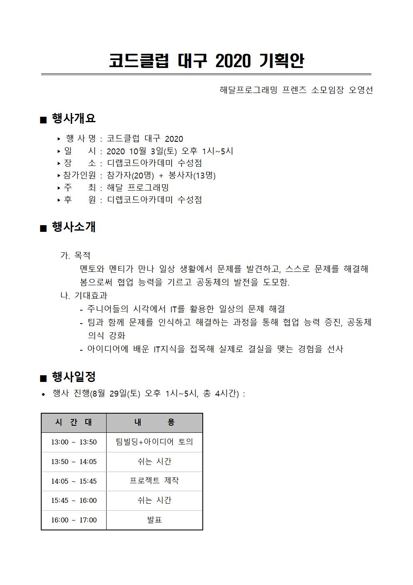
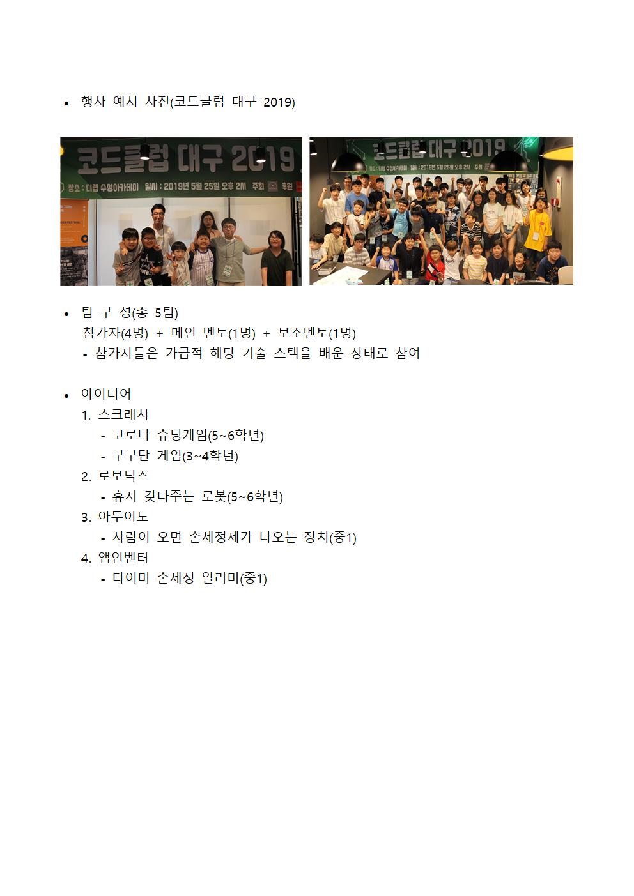

# 2020 코드클럽 대구

## 기획안

## 가이드문서

1. 스크래치
- 표승완
    + 조혜민
- 신준철
    + 박세희
2. 앱인벤터
- 이윤지
    + 박민지
3. 로보틱스
- 홍성목
    + 김주원
4. 아두이노
- 권현수
    + 강종연
    
## 코드클럽 일정
8.5 : 메인멘토 선발
***
8.5~8.10 : 보조멘토/운영팀 선발
***
8.11~9.20 : 팀구성 완료 및 각 주제에 대한 시범제작, 가이드 문서 제작
***
10.3 : 2020 코드클럽 대구