## 주제 : 바이러스 피하기 게임 만들기

**팀원 : 이윤지, 박민지**   
**메인 - 이윤지**
**보조 - 박민지**

# 앱인벤터란?

- 앱인벤터란?

→ MIT가 관리하는 오픈소스 앱메이커로 안드로이드 운영체제용 응용소프트웨어를 만들 수 있게 해주는 프로그램

→ 즉, 간단한 안드로이드용 앱을 개발 할 수 있는 프로그램이다.

# 앱인벤터 사용을 위한 준비

### 1.  Google PlayStore에서 'MIT AI2 companion' 어플 다운

### 2. google에서 앱인벤터 검색 → 'MIT App Inventor' 클릭

→ 클릭  후 로그인 (google 계정이 없을 경우, 회원가입 필요)

### 3. 로그인 후 'Create Apps' 클릭

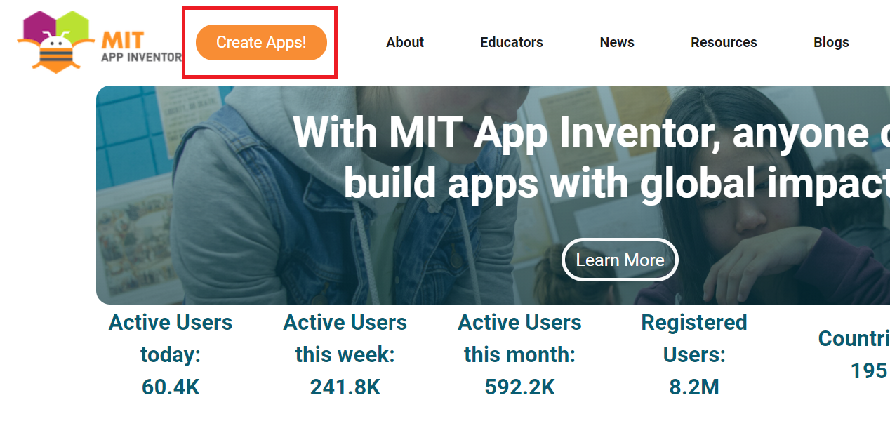

이제 어플을 만들어볼 준비가 되었다!

### 4. 연결 확인 하기

먼저 연결확인을 하기 위해 간단한 프로젝트를 만들어 보자(앱인벤터 홈페이지와 어플이 잘 연결 되는지 확인 하는 것이므로 어떤 프로젝트든 좋다)

핸드폰에서 'MIT AI2 companion' 어플 실행 후 'SCAN QR' 선택 후 OR 코드 복사

## 앱인벤터 둘러보기

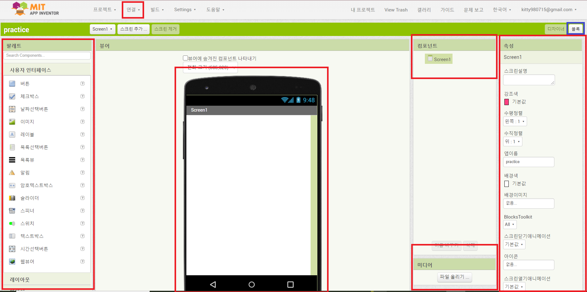

앱인벤터에는 다양한 요소들이 존재한다. 하나씩 살펴보도록 하자.

우선 앱인벤터는 크게 디자이너 파트와 블록 파트로 나눌 수가 있는데, 디자이너 파트에서 컴포넌트들을 추가하고 블록 파트에서 코딩을 하는 방식이다. 

프로젝트를 열었을 때 화면 우측 상단에 있는 디자이너/블록 버튼으로 디자이너 파트와 블록 파트를 전환할 수 있다.

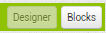

- 디자이너 파트

디자이너 파트는 팔레트, 뷰어, 컴포넌트, 미디어, 속성 등의 요소들이 있다. 이 기능들을 하나씩 살펴보자.

- 팔레트

팔레트는 우리가 앱을 디자인할 때 사용할 여러 컴포넌트들이 모여있는 곳이다. 

컴포넌트의 속성별로 분류가 되어있고, 여기서 필요한 컴포넌트들을 끌어와서 디자이너 화면에 추가할 수 있다. 

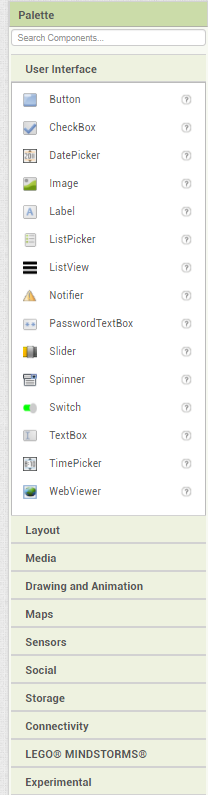

- 뷰어

뷰어 파트에서는 앱을 구현했을 때 우리가 보게 될 화면을 디자인할 수 있다. 위에서 설명한 팔레트에서 컴포넌트들을 끌어와서 뷰어의 원하는 위치에 놓아 앱을 디자인할 수 있다.

※ 그러나, 디자인 화면과 실제 앱을 구동시켰을 때의 화면이 반드시 일치하지는 않으므로 앱을 만드는 중간중간 스마트폰과 연결하여 앱이 어떻게 구동되는 지 확인할 필요가 있다. 

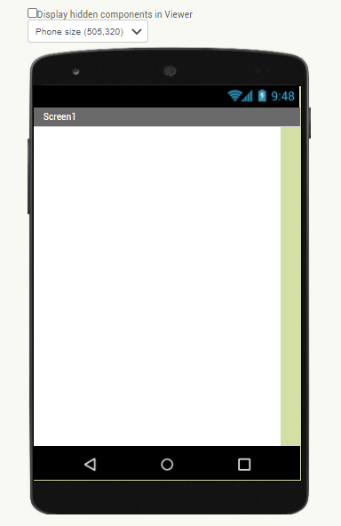

- 컴포넌트

컴포넌트 에서는 우리가 팔레트에서 뷰어에 추가한 요소들을 한눈에 파악할 수 있다. 컴포넌트들이 어떤 순서로 되어있는지, 어떤 레이아웃에 들어있는지, non-visible 컴포넌트들은 어떻게 추가되어 있는지 등을 확인할 수 있다.

또한, Rename 버튼을 눌러 추가한 컴포넌트들의 이름을 알아보기 쉽게 바꿀 수도 있고, Delete 버튼으로 컴포넌트들을 삭제할 수도 있다. 

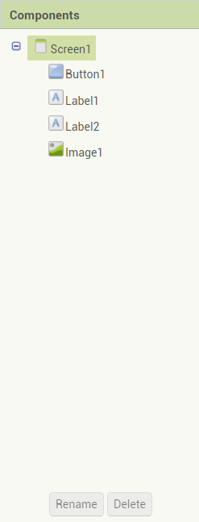

- 속성(Properties)

속성에서는 내가 선택한 컴포넌트의 속성들을 설정할 수 있다. 각 컴포넌트의 종류마다 속성값은 다르게 나타난다.

예를 들어, 아래 사진에는 Screen1의 속성이 나와 있는데, 여기서 배경색, 정렬 방법, 이미지 첨부 등을 설정해 줄 수 있다. 

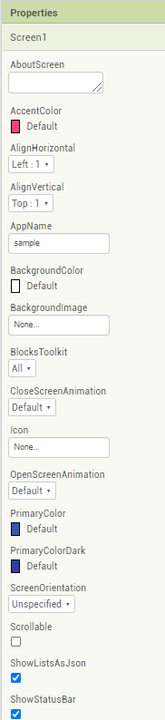

- 미디어

미디어 에서는 내가 사용하고자 하는 이미지나 음악, 영상 파일과 같은 미디어 파일들을 업로드할 수 있다. 단, 너무 용량이 큰 미디어 파일들은 업로드할 수 없고, 5MB 이하의 파일을 업로드해야 한다.

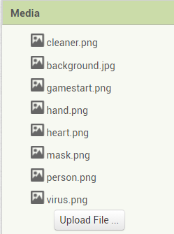

- 블록 파트

블록 파트에서는 본격적으로 내가 추가한 컴포넌트들이 수행할 작업을 코딩할 수 있다.

왼쪽 블록에서 앱인벤터가 기본적으로 제공하는 빌트인(공통) 블록들과 내가 추가한 컴포넌트들에 대한 블록들을 모두 사용할 수가 있다. 

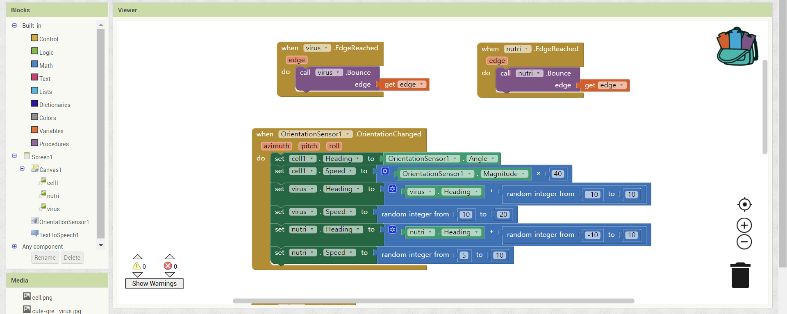

또, 내가 자주 사용하는 블록들을 가방으로 끌어와서 즐겨찾기 식으로 저장하여 사용할 수도 있으며 확대/축소, 삭제하기 등 여러 기능이 존재한다.

예를 들어, 다음은 빌트인(공통) 블록의 컨트롤(제어) 부분에 해당하는 블록들이다.

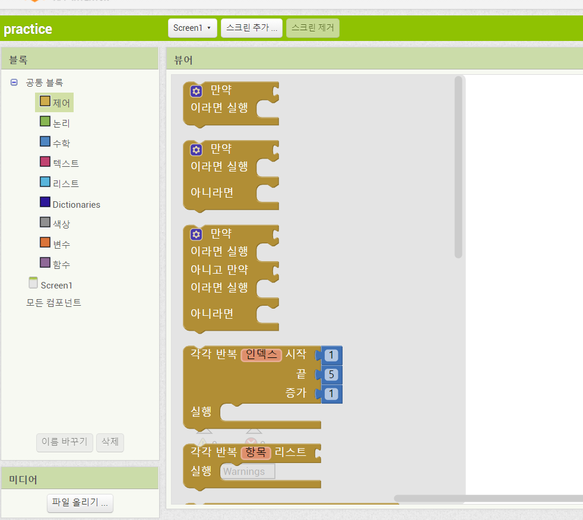

그럼 이제 본격적으로 앱을 만들러 가보자!

## 바이러스 피하기 게임을 만들어 보자!

### 게임화면 미리보기

- SCREEN 1

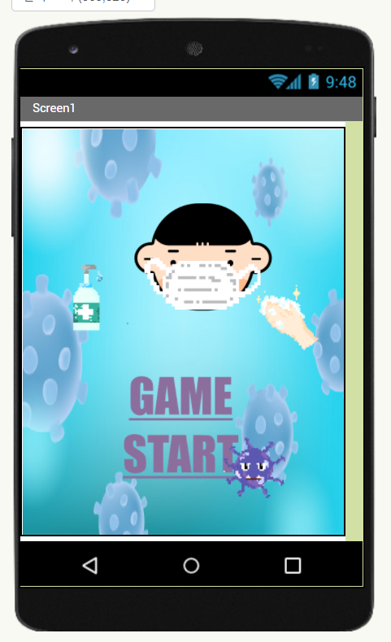

- 구현해야 할 기능
- [ ]  게임 시작 버튼을 누르면 게임 화면(SCREEN 2)으로 넘어가기

- SCREEN 2(게임 화면)

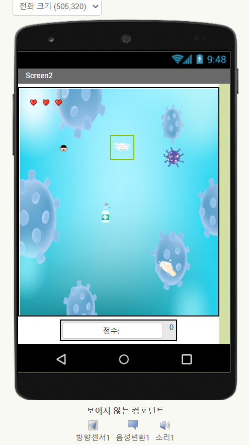

- 구현 해야 할 기능
- [ ]  방향 센서를 통해 핸드폰 기울기 변화를 감지하여 내 캐릭터 이동
- [ ]  마스크, 손 씻기, 손 세정제에 닿으면 점수 추가, 내 캐릭터 크기 커지기
- [ ]  바이러스에 닿으면 바이러스의 크기 커짐, 생명 깎임
- [ ]  바이러스 or 다른 이미지에 닿으면 음성으로 현재 점수 알려 줌
- [ ]  바이러스에 3번 닿게 되면 진동 울리며 게임 종료

### 디자인

→ 블록 코딩을 하기 전에 필요한 컴포넌트들을 추가해주자

- SCREEN 1

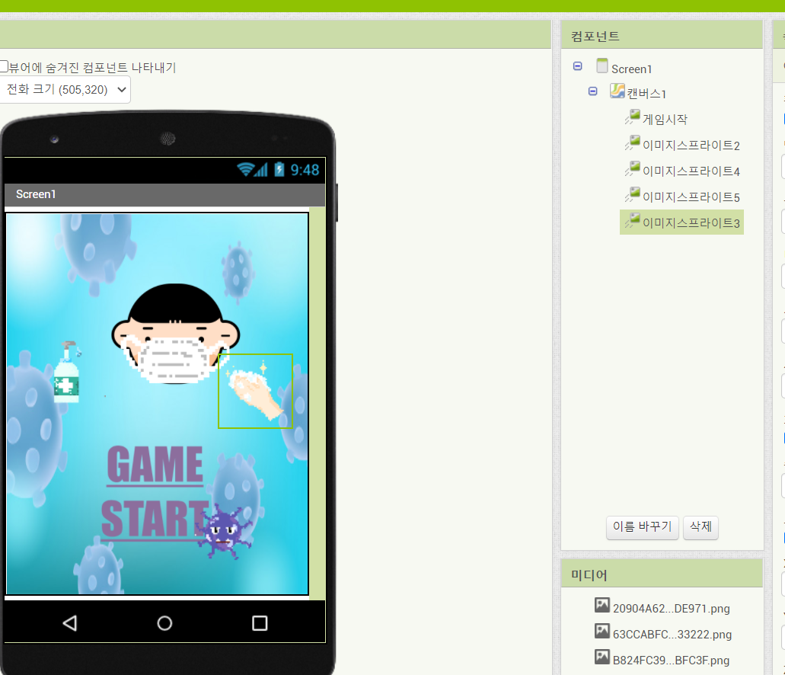

→ 캔버스에 이미지 스프라이트를 추가하여 게임 시작 버튼을 원하는 위치에 넣어준다.

나머지 다양한 이미지로 게임 대기화면을 꾸며 보자! (선생님이 준 사진들 말고도 인터넷에서 다양한 사진들을 다운 받아 대기화면을 꾸며보세요)

- SCREEN 2

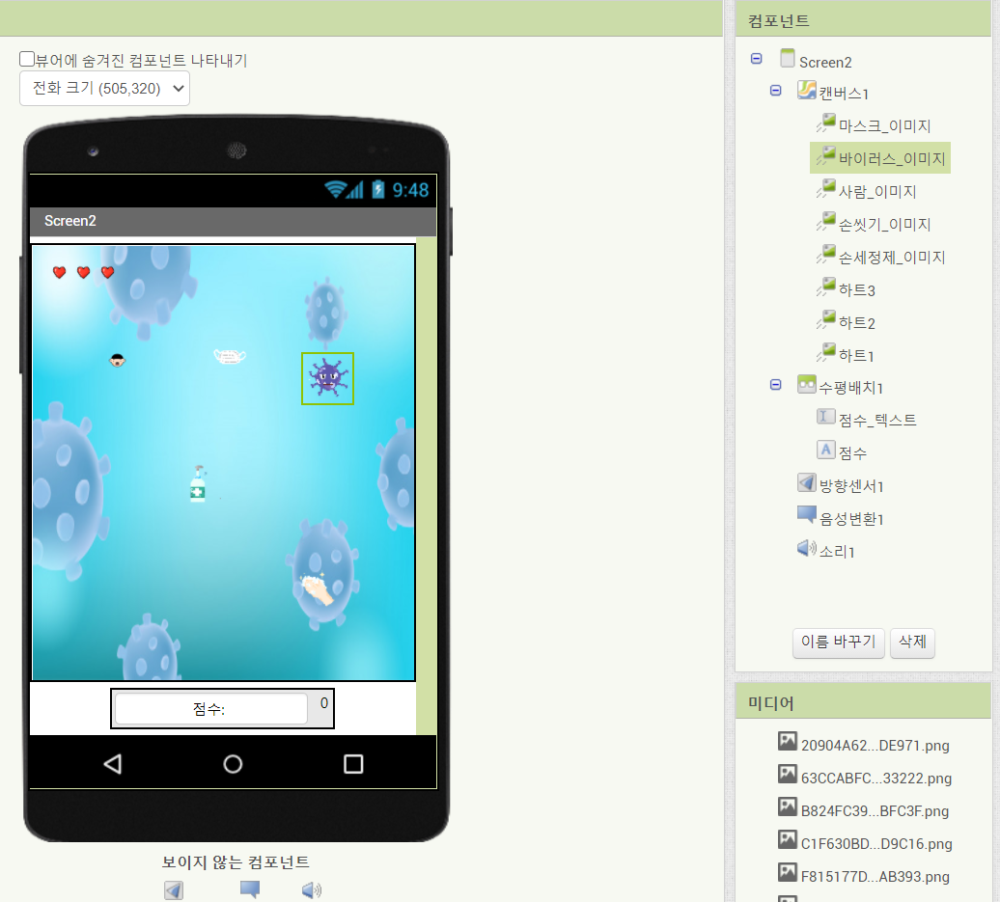

1. 필요한 요소들을 추가하고 블록 코딩을 할 때 찾기 쉽게 컴포넌트의 이름을 변경하자
2. 변경한 컴포넌트의 이름에 맞는 이미지를 업로드하자 (크기 조정)
3. 캔버스에 배경을 추가하고 높이와 너비는 부모요소에 맞추기 선택 

    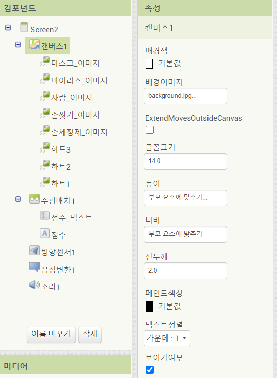

4. 점수_텍스트 레이블에 텍스트 입력 , 텍스트 정렬 가운데

필요한 컴포넌트들을 추가 및 설정들을 모두 완료 해주었다.  이제 블록 코딩을 해보자

### 블록

 

- SCREEN 1

→ 게임 시작 버튼을 누르면 게임 화면으로 이동

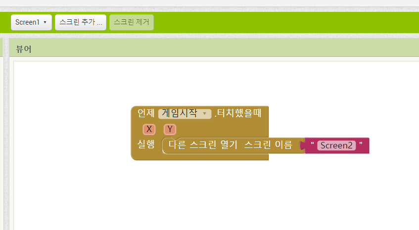

- SCREEN 2
1.  초기화

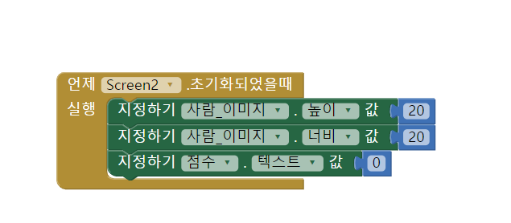

2. 내 캐릭터, 바이러스 방향 및 속도 설정

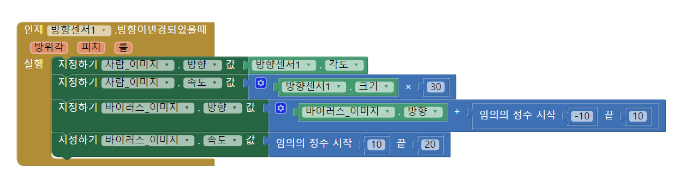

3.  모서리에 닿았을 때 튕기기

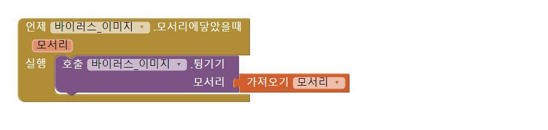

4.  캐릭터와 다른 이미지 스프라이트와 닿았을 때

→ 반복되는 부분은 함수를 넣어서 블록 길이를 줄이자

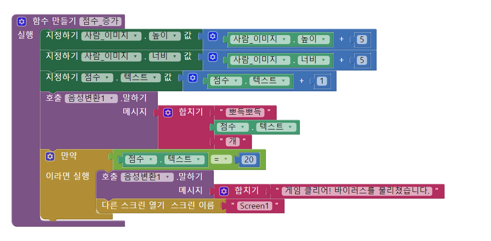

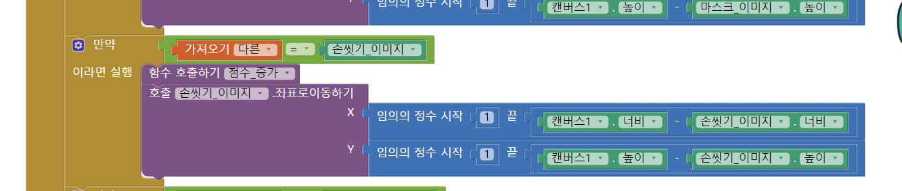

→ 바이러스와 닿았을 때

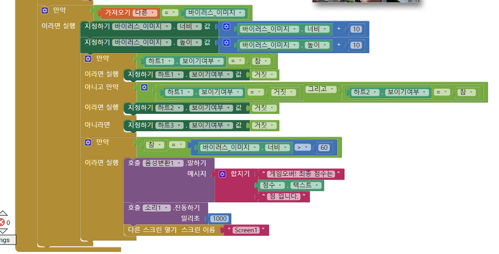

