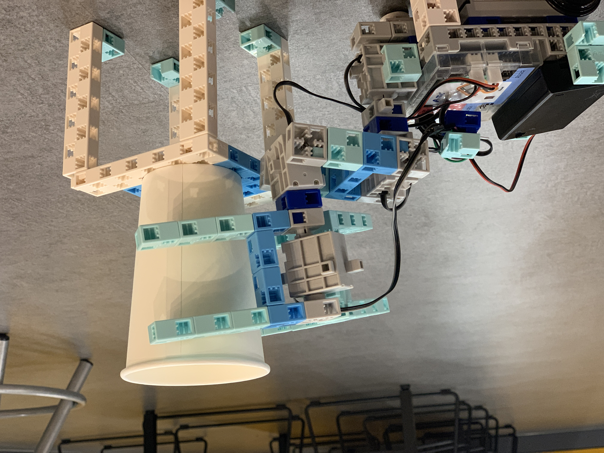
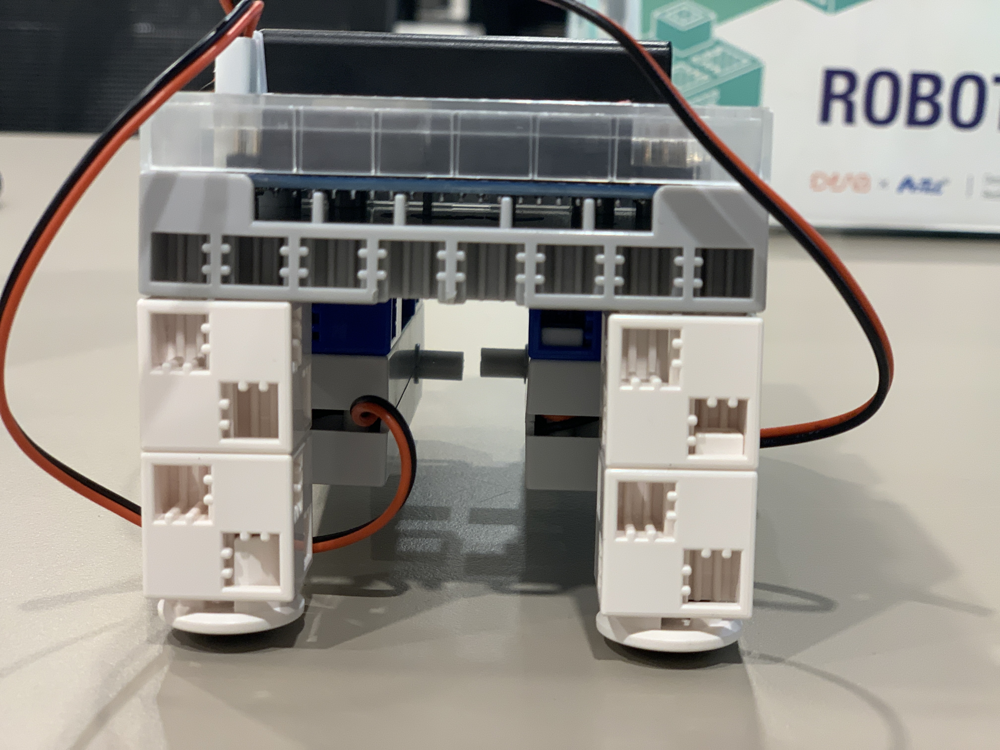
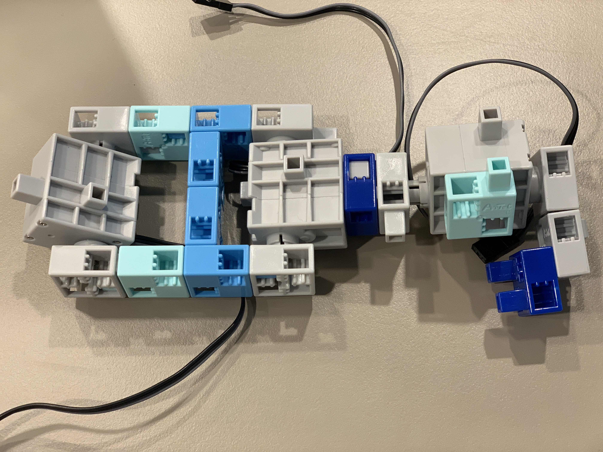
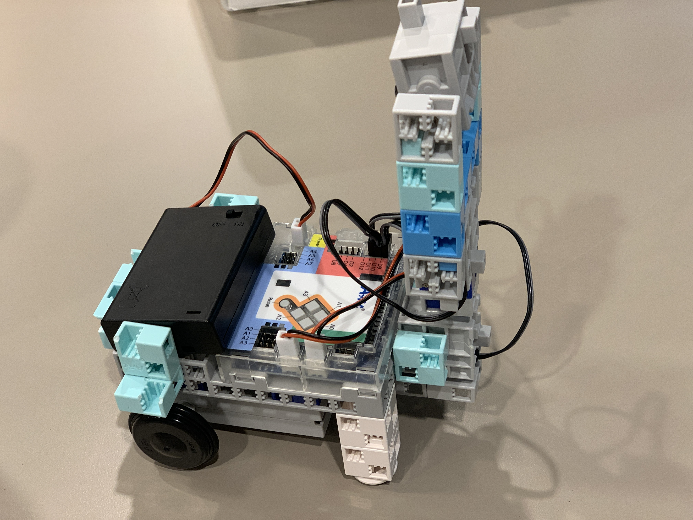
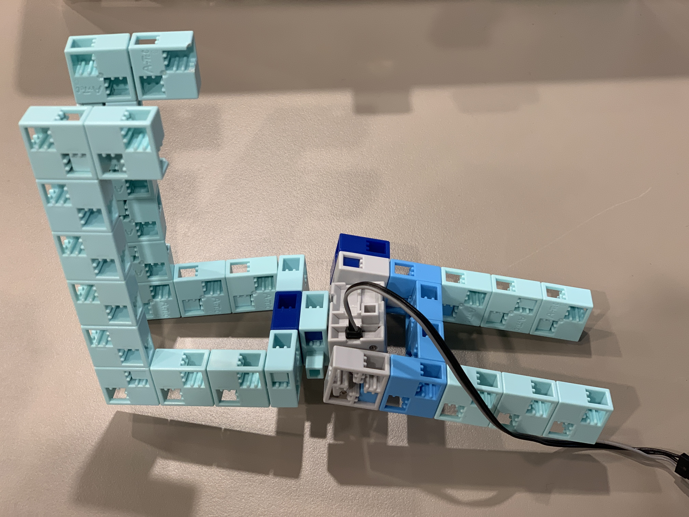
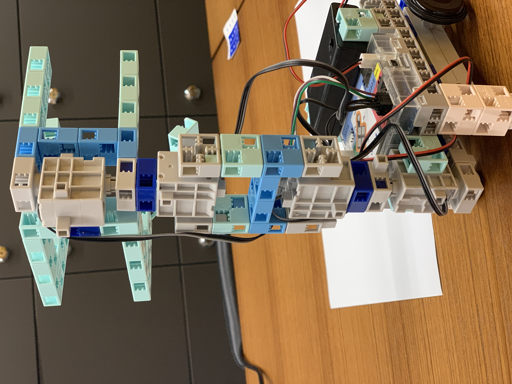
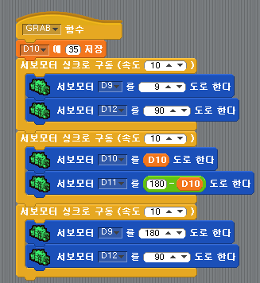
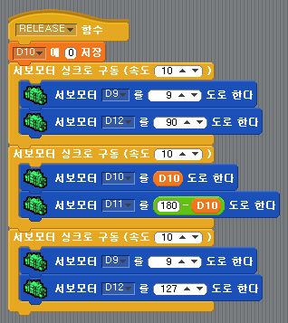

## 로보틱스 - 서빙 로봇 만들기

### 제작 동기

우리는 코로나(COVID-19) 사태로 인해 많은 것이 비대면이 된 세상을 상상하였다. 해서 현대인들이 가장 많이 이용하는 시설 중 하나인 카페, 식당 등에서 유용하게 사용할 수 있는 서빙 로봇을 만들어보고자 한다.

### 팀원 
메인 - 홍성목
 보조 - 김주원

### 제작 과정

#### 로봇 만들기

1. 차를 만든다. 차 뒷부분은 무게중심을 고려하여 다음과 같이 제작한다.

2. 서보모터와 블록을 이용하여 로봇 팔 부분을 제작한다.

3. 2번에서 만든 로봇팔을 차량 후면에 부착한다.

4. 커피를 잡을 집게를 제작한다.

5. 3번에서 만든 로봇에 집게를 부착한다.

#### 코드

### 결과물 (영상의 경우 유튜브 링크 활용 가능)

[RELEASE](https://youtu.be/FusoAc_LwDA)