# 주제 :스크래치로 만드는 코로나 슈팅게임

#### 팀원 : 메인 - 신준철 / 보조 - 박세희

#### 내용 : 몸이 안좋아 병원을 찾은 A씨.. 코로나19에 감염됐다는 진단을 받는데! 나노로봇은 과연 코로나 바이러스를 물리치고 A씨를 구할 수 있을것인가!!

#### 제작 과정 : 
**characters1**  
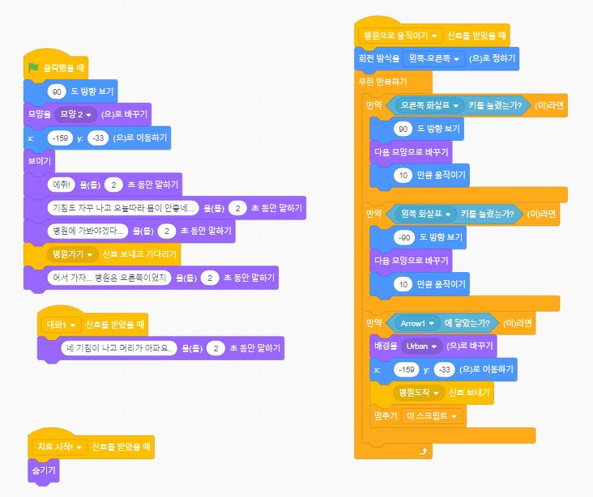   
   
 깃발을 누르면 게임이 시작되고 사람 캐릭터가 등장한다.   
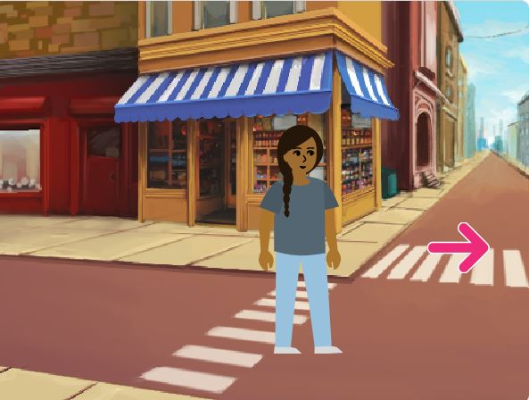   
 멘트를 말한 후 병원으로 가는 화살표가 나온다.

**Arrow1**   
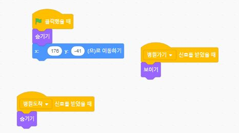      
 병원가기 신호를 받았을 때만 등장한다.   
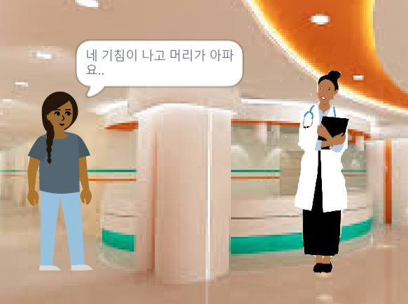   
 화살표에 닿으면 병원으로 이동한다. (배경이 바뀌고 의사가 등장)

**doctor**   
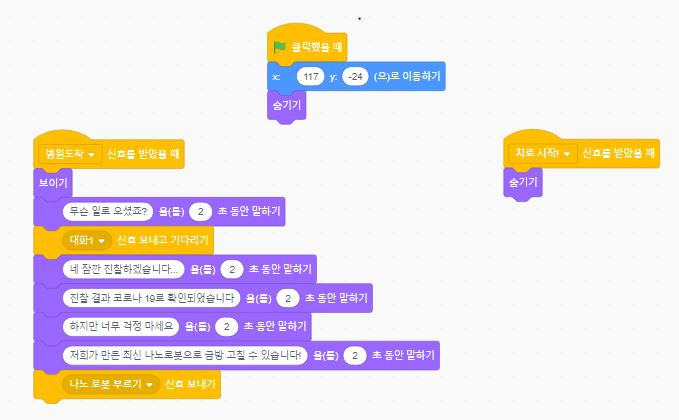
1. 환자가 병원에 도착했을 때만 등장한다.
2. 환자가 도착하면 대화를 하고 나노 로봇을 부른다.

**Cat Flying**   
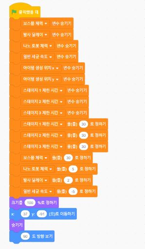   
게임이 시작되면 필요한 변수들을 설정해 준다.

   
의사에게서 호출 신호를 받으면 등장한다.

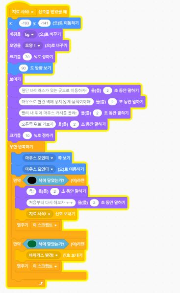    
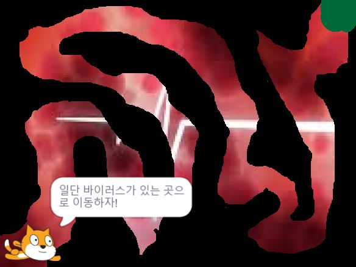   
마우스를 이용해 고양이를 움직여 바이러스 위치까지 이동한다.
혈관벽에 닿으면 다시 시작.  

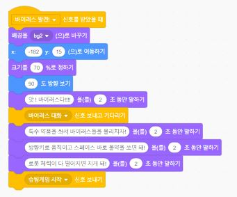   
바이러스 위치에 도착하면 발견 신호를 보내고 슈팅게임을 시작한다.

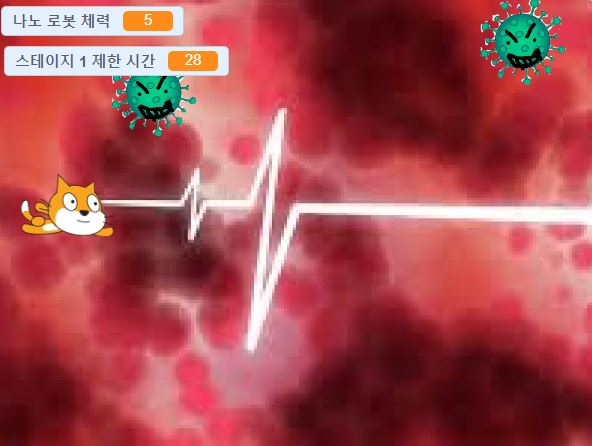   
1. 슈팅게임 시작 신호를 받으면 게임을 시작한다.
2. 숨겨놨던 스테이지1 제한시간과 나노로봇체력 변수를 보이게 설정한다.
3. 1초마다 스테이지 제한 시간이 감소한다. 0이 되면 게임을 종료한다.
4. 나노로봇은 화살표로 움직일 수 있고 체력이 0이되면 치료에 실패한다.
5. 스테이지1 종료 신호를 받으면 스테이지2를 시작한다.

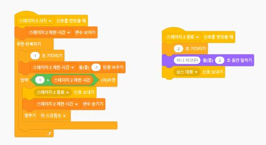
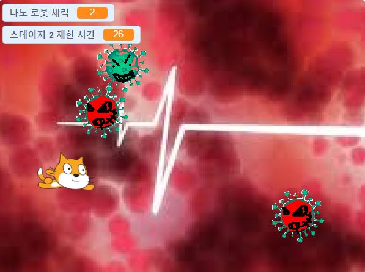   
1. 스테이지2 시작 신호를 받으면 숨겨놨던 스테이지2 제한 시간 변수를 보이게 설정한다. 마찬가지로 시간이 0이 되면 게임을 종료한다.
2. 스테이지2 종료 신호를 받으면 보스와 대화를 한다.

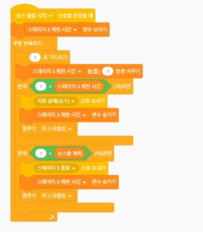   
1. 보스 스테이지가 시작되면 숨겨놨던 스테이지3 제한 시간 변수를 보이게 설정한다.
2. 이번에는 제한 시간이 0이 되면 치료에 실패하고 보스몹의 체력이 0이 되면 치료에 성공한다.

   
치료 실패 신호와 성공 신호에따라 종료 멘트가 달라진다.

**virus**   
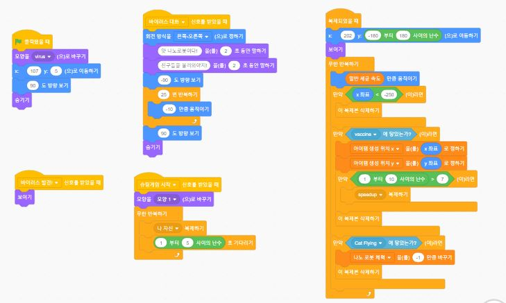   
1. 게임이 시작했을 때는 보이지 않다가 바이러스 발견 신호를 받으면 보인다. 
2. 슈팅게임을 시작하면 복제되어 공격한다.
3. 나노로봇에 닿으면 로봇의 체력이 1 깍인다.
4. 백신의 공격을 맞으면 사라지고 랜덤한 확률로 스피드업 아이템을 드랍한다.

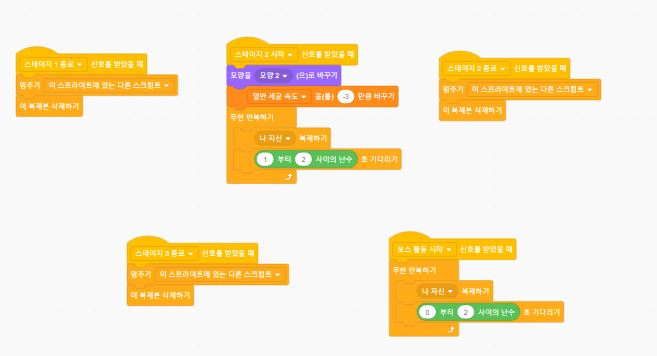   
스테이지2에서는 모양이 바뀐다.

**vaccine**   
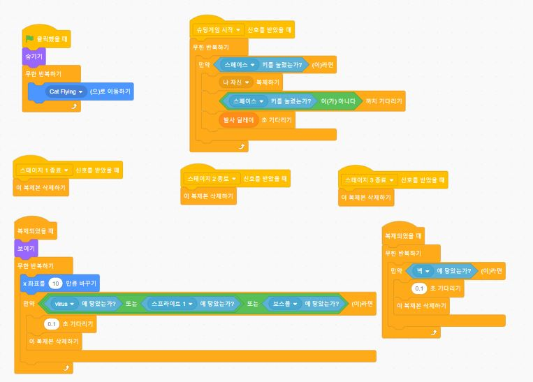   
1. 스페이스바를 누르면 백신이 발사된다.
2. 발사에는 딜레이가 있다.
3. 몹에 닿거나 벽에 닿으면 사라진다.

**speedup**   
   
1. 바이러스1이 죽을 때 랜덤 확률로 드랍한다.
2. 스피드업 아이템을 먹으면 백신 발사 속도가 빨라진다.

**virus2(스프라이트1)**   
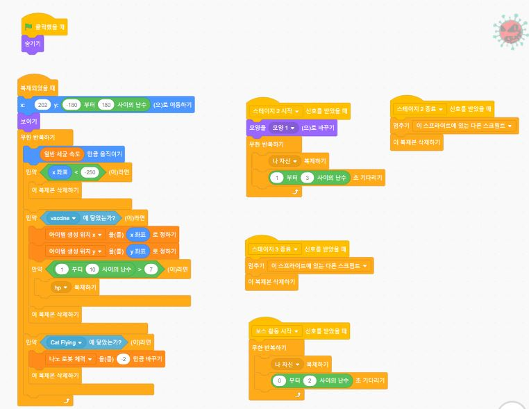   
1. 스테이지2부터 등장하는 바이러스몹이다.
2. 백신을 맞으면 랜덥한 확률로 hp 아이템을 드랍한다.
3. 나노로봇에 닿으면 로봇의 체력이 2만큼 깍인다.

**hp**   
   
1. 바이러스2가 죽을 때 랜덤 확률로 드랍한다.
2. 나노로봇의 체력을 1만큼 회복시킨다.

**보스**   
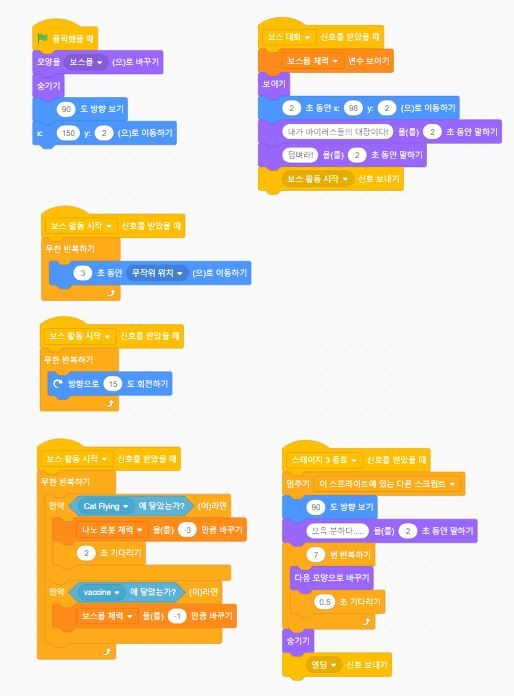   
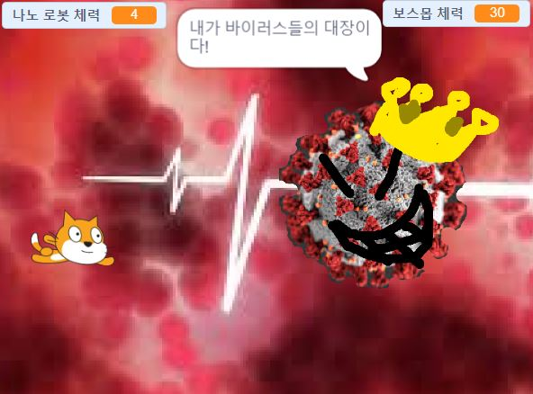   
1. 보스몹에 닿으면 나노로봇의 체력이 3만큼 깍인다.
2. 백신에 닿으면 보스몹의 체력이 1만큼 깍인다.

#### 결과물 :
[게임하러가기](https://scratch.mit.edu/projects/428907331/)
